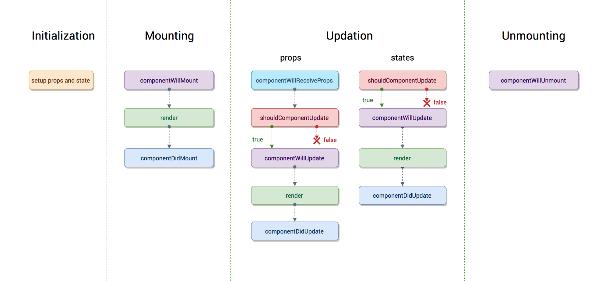

1. **react**: **open-source front-end JavaScript library**, Jordan Walke(SE working @ FB). First deployed on FB's News Feed 2011, Instagram 2012
2. **major feature**: **virtual dom** instead of realDOM considering RealDOM manipulations are expensive. 
    * Supports **server-side rendering**
    * Follows **unidirectional** data flow or data binding. 
    * uses **reusable/composable** UI components to develop the view
3. **JSX**: XML like syntax extension to ECMA script. `React.createElement()`
```javascript 
class App extends React.Component {
  render() {
    return(
      <div>
        <h1>{'Welcome to React world!'}</h1>
      </div>
    )
  }
}
```
4. **Element & Component**: Element is plain object describing what you want to appear on the screen in terms of DOM nodes or other components. 
    > **NOTE**: Elements can contain other elements in their props. It is cheap to create and can **never be mutated**
```javascript
// Object representation of React element
const element = React.createElement(
    'div', 
    {id: 'login-btn'},
    'Login'
)
```
* the above react.createElement function returns an object 
```
{
  type: 'div',
  props: {
    children: 'Login',
    id: 'login-btn'
  }
}
```
* finally it renders to the DOM using `ReactDOM.render()`
> <div id='login-btn'>Login</div>
<br/>

* **Component**: It can be defined as class with render() method or it can be defined as a function. It takes props as input and returns a JSX tree as output 
```javascript 
const Button = ({ onLogin }) => 
    <div id={'login-btn'} onClick={onLogin}>Login</div>
```
5. **Creating components in React**: 
    1. Functional Components: Pure JS functions that accepts props object as the first param and return React elements. 
    ```
    function Greeting({message}){
        return <h1>{`Hello, ${message}`}</h1>
    }
    ```
    2. Class Components: You can also use ES6 class to define a component. 
    ```
    class Greeting extends React.Component{
        render(){
            return <h1>{`Hello, ${this.props.message}`}</h1>
        }
    }
    ```
6. **Class components over a Function components**: If components needs *8state or lifecycle methods** then use class component otherwise use function component 
> **NOTE** From React 16.8 with the addition of Hooks you could use state, lifecycle methods and other features that were only avaiable in class component right in your function components. 
7. **Pure Components**: `React.PureComponent` is exactly same as `React.Component` except that it handles the `shouldComponentUpdate()` method for you. When prop or state changes then Pure components will do a **shallow comparison on both the props and state**. Component will re-render by default whenever `shouldComponentUpdate` is called. 
8. **State**: A state of component is an object and It holds some information that may change over the lifetime of the component. We should try to make out state as simple as possible and minimize the number of stateful components. **State is used for internal communication inside a components**
```javascript
class User extends React.Component {
    constructor(props){
        super(props)

        this.state = {
            message: 'Welcome to React World'
        }
    }

    render(){
        return (
            <div>
                <h1>{this.state.message}</h1>
            </div>
        )
    }
}

```
9. **props**: Inputs to components. they are single values or objects containing set of values that are passed to components on creation using naming convention similar to HTML-tag attribtues. they are passed down from parent component to a child component. 
* Primary **purpose of props**: 
    1. Pass custom data to your component 
    2. Trigger state change 
    3. Use via `this.props.reactProp` inside components render() method.

10. **State vs Props**: Both are JS objects, while both hold information that influence output of renders. Props get passed to component similar to function parameters where-as state is managed within the component similar to variables declared within function.

11. **Why should we not update state directly?**: If you update state directly then it wont re-render the components. eg. this.state.message = 'Hello world'
* instead use `setState()` method which **schedules an update to a component's state object** when state changes, the component responds by re-rendering. eg `this.setState({message: 'hello world!'})`
12. **purpose of callback function as argument of `setState()`
* callback function is invoked when setState finished and the component gets rendered. Callback is used for post action as setState is async
> **NOTE**: It is recommended to use lifecycle method rather than this callback function 
```javascript 
setState({name: 'john'}, 
    () => console.log('this name has been updated and component re-rendered'))
```

13. Difference between HTML and React event handling 
* in HTML, the event name usually represents in lowercase as convention. <button onclick=\'activateLasers()'> where as in **react we use camelCase** convention \<button onClick=\{activateLasers\}>
* in HTML, you can return false to prevent default behavior: 
> \<a href='#' onclick='console.log("The link was clicked."); return false;' />

Whereas in React you must call `preventDefault()` explicitly
```javascript
function handleClick(event){
    event.preventDefault()
    console.log('this link was clicked')
}
```
* in HTML, you need to invoke the function by appending () whereas in react you should append () with the function name. 

14. **Bind methods or event handlers in JSX callbacks** : 
    1. **Binding in constructor**: in jS classes, the methods are not bound by default. The same thing applies for React event handlers defined as class methods. We bind then in constructor. 
    ```
    class Foo extends Components {

        constructor(props){
            super(props);
            this.handleClick = this.handleClick.bind(this);
        }

        handleClick(){
            console.log('click happened');
        }

        render(){
            return <button onClick={this.handleClick}>Click Me</button>
        }
    }
    ```
    2. **Public class fields syntax**: If you dont like bind approach then use public class fields syntax
    ```
    handleClick = () => {
        console.log("this is:", this )
    }

    <button onClick={this.handleClick}>{'Click me'}</button>
    ```
    3. **Arrow functions in callbacks**: you can use arrow func directly in callbacks
    ```
    handleClick(){
        console.log('Click happened')
    }

    render(){
        return <button onClick={() => this.handleClick()}>Click Me</button>
    }
    ```
    > **NOTE**: If the callback is passed as prop to child components, those components might do an extra re-rendering. In those cases, it is preferred to go with .bind() or public class fields syntax approach considering performance.

15. **pass a param to an event handler or callback**
* You can use an arrow function to wrap around an event handler and pass parameters:
```javascript
<button onClick={() => this.handleClick(id)} />
```
* This is an equivalent to calling .bind:
```javascript
<button onClick={this.handleClick.bind(this, id)} />
```
* Apart from these two approaches, you can also pass arguments to a function which is defined as arrow function
```javascript
<button onClick={this.handleClick(id)} />
handleClick = (id) => () => {
    console.log("Hello, your ticket number is", id)
};
```

16. **Synthetic events**: Is a cross-browser wrapper around the browser's native event. in API is same as the browser's native event, including `stopPropagation()` and `preventDefault()`, except the events work identically across all browsers. 

17. **Inline conditional expressions**: if statement or ternary expression which are available from JS to conditionally render expressions. 
```javascript 
<h1>Hello!</h1>
{
    messages.length > 0 && !isLogin?
      <h2>
          You have {messages.length} unread messages.
      </h2>
      :
      <h2>
          You don't have unread messages.
      </h2>
}
```
18. **key prop and what is benefit of using it in arrays of elements**: A key is special string attribute you should include when creating arrays of elements. It helps React identify which items have changed, are added or are removed. **most often we use ID from our data as key**
```javascript 
const todoItems = todos.map((todo) =>
  <li key={todo.id}>
    {todo.text}
  </li>
)
```
* In absence, you may use the item index as a key as a last resort: 
```javascript
const todoItems = todos.map((todo, index) =>
  <li key={index}>
    {todo.text}
  </li>
)
```
> **Note**: Using indexes for keys is not recommended if the order of items may change. This can negatively impact performance and may cause issues with component state.
If you extract list item as separate component then apply keys on list component instead of li tag.

19. **refs**: used to return reference of the element. they should be avoided in most cases, however they can be useful when you need a direct access to the DOm element or an instance of a component.

20. **how to create refs?**: two approaches 
    1. This is recently added approach: refs are created using `React.createRef()` method and attached to react elements via the `ref` attribute. 
    ```javascript
    class MyComponent extends React.Component {
    constructor(props) {
        super(props)
        this.myRef = React.createRef()
    }
    render() {
        return <div ref={this.myRef} />
    }
    }
    ```
    2. You can use ref callbacks approach regardless of React version. 
    ```javascript 
    class SearchBar extends Component {
    constructor(props) {
        super(props);
        this.txtSearch = null;
        this.state = { term: '' };
        this.setInputSearchRef = e => {
            this.txtSearch = e;
        }
    }
    onInputChange(event) {
        this.setState({ term: this.txtSearch.value });
    }
    render() {
        return (
            <input
                value={this.state.term}
                onChange={this.onInputChange.bind(this)}
                ref={this.setInputSearchRef} />
        );
    }
    }
    ```

24. **Virtual DOM**: is an im-memory representation of Real DOM. The representation of UI is kept in memory and synced with "real" DOM. It's step that happens between the render function being called and the displaying of elements on the screen . This process is called **reconciliation**

25. **Virtual DOM works**: Three simple steps: 
    1. Whenever any underlying data changes, the entire UI re-rendered in virtual DOM representation.
    
    2. Then the difference between the previous DOM representation and the new one is calculated. 
    
    3. Once the calculations are done, the real DOm will be updated with only the things that have actually chaned. 
    

26. **Shadow DOM vs Virtual DOM**: Shadow DOM is browser tech designed primarily for scoping variables and CSS in web components. Virtual DOM is a concept implemented by libraries in JS on top of browser APIs. 

27. **React Fiber**: new **reconciliation** engine or implementation of core algo in React16. It is aimed at increasing its suitability in areas like animation, layout, gestures, ability to pause, abort or reuse work and assign priority to different types of updates and new concurrency primitives. 

29. **Controlled components**: a component that controls the input elements within the forms on subsequent user input is called controlled components ie ** every state mutation will have an associated handler function**
```javascript 
handleChange(event) {
  this.setState({value: event.target.value.toUpperCase()})
}
```
30 **uncontrolled components**: are those that store their own state internally and you query the DOM using a ref to find its current value when you need it. this is abit more tradtional HTML
```javascript 
class UserProfile extends React.Component {
  constructor(props) {
    super(props)
    this.handleSubmit = this.handleSubmit.bind(this)
    this.input = React.createRef()
  }

  handleSubmit(event) {
    alert('A name was submitted: ' + this.input.current.value)
    event.preventDefault()
  }

  render() {
    return (
      <form onSubmit={this.handleSubmit}>
        <label>
          {'Name:'}
          <input type="text" ref={this.input} />
        </label>
        <input type="submit" value="Submit" />
      </form>
    );
  }
}
```
* it is recommended to use controlled compoenents to implements forms. In controlled component, the data is handled by a React component. 
31. **createElement vs cloneElement**: JSX element will be transpiled to `React.createElement()` function to create React element which are going to be used for the object repsentation of UI. whereas `cloneElement` is used to clone an element and pass it new props. 

33. **Different phases of component lifecycle**: 
    1. **mounting**: the component is ready to mount in browser DOM. This phase covers initialization from `constructor()`, `getDerivedStateFromProps()` and `componentDidMount()` lifecycle methods
    2. **updating**: In this phase, the component gets updated in two ways, sending the new props and updating the state either from `setState` or `forceUpdate`. This phase covers `getDerivedStateFromProps`, `shouldComponentUpdate` and `render`, `getSnapshotBeforeUpdate` and `componentDidUpdate` 
    3. **unmounting**: in this last phase, the component is not needed and gets unmounted from the browserDOM. This includes `componentWillUnmount`
    * React 16.3+
    
    * before React 16.3
    

34. **Life Cycle methods**
What are the lifecycle methods of React?
* **Before React 16.3**

    * **componentWillMount**: Executed before rendering and is used for App level configuration in your root component.
    * **componentDidMount**: Executed after first rendering and here all AJAX requests, DOM or state updates, and set up event listeners should occur.
    * **componentWillReceiveProps**: Executed when particular prop updates to trigger state transitions.
    * **shouldComponentUpdate**: Determines if the component will be updated or not. By default it returns true. If you are sure that the component doesn't need to render after state or props are updated, you can return false value. It is a great place to improve performance as it allows you to prevent a re-render if component receives new prop.
    * **componentWillUpdate**: Executed before re-rendering the component when there are props & state changes confirmed by shouldComponentUpdate() which returns true.
    * **componentDidUpdate**: Mostly it is used to update the DOM in response to prop or state changes.
    * **componentWillUnmount**: It will be used to cancel any outgoing network requests, or remove all event listeners associated with the component.

* **React 16.3+**

    * **getDerivedStateFromProps**: Invoked right before calling render() and is invoked on every render. This exists for rare use cases where you need a derived state. Worth reading if you need derived state.
    * **componentDidMount**: Executed after first rendering and where all AJAX requests, DOM or state updates, and set up event listeners should occur.
    * **shouldComponentUpdate**: Determines if the component will be updated or not. By default, it returns true. If you are sure that the component doesn't need to render after the state or props are updated, you can return a false value. It is a great place to improve performance as it allows you to prevent a re-render if component receives a new prop.
    * **getSnapshotBeforeUpdate**: Executed right before rendered output is committed to the DOM. Any value returned by this will be passed into    componentDidUpdate(). This is useful to capture information from the DOM i.e. scroll position.
    * **componentDidUpdate**: Mostly it is used to update the DOM in response to prop or state changes. This will not fire if shouldComponentUpdate() returns false.
    * **componentWillUnmount** It will be used to cancel any outgoing network requests, or remove all event listeners associated with the component.

35. **Higher Order Component**: Function that takes a component and returns a new component. Pattern derived from **React compositional nature**. We call them **pure components** because they can accept any dynamically provided child component but they won't modify or copy any behavior from their input components. 
* Use cases: 
    1. Code re-use, logic and bootstrap abstraction
    2. Render hijacking
    3. State abstraction and manipulation
    4. Props manipulation

36. **Props proxy for HOC component**: We can add edit props passed to component using **props proxy pattern**
```javascript 
function HOC(WrappedComponent){
    return class Test extends Component {
        render(){
            const newProps = {
                title: 'New Header', 
                footer: false, 
                showFeatureX: false, 
                showFeatureY: true
            }

            return <WrappedComponent {...this.props} {...newProps}>
        }
    }
}
```

37. **Context**: It provides a way to pass data through the component tree without having to pass props down manually at every level.
```javascript
const {Provider , Consumer} = React.createContext(DefaultValue);
```

38. **Child Prop**: **Children** is a prop(this.props.children) that allows you to pass components as data to other components just like any other prop you can use. component tree put between component's opening and closing tag will be passed to that component as `children` prop. 
```javascript
const MyDiv = React.createClass({
  render: function() {
    return <div>{this.props.children}</div>
  }
})

ReactDOM.render(
  <MyDiv>
    <span>{'Hello'}</span>
    <span>{'World'}</span>
  </MyDiv>,
  node
)
```

39. **Comments in React**: Comments are similar but they are wrapped in curly braces. 
```
<div>
{/*single line comment*/}
</div>
<div>
{/*Multi line
 comment*/}
</div>

```
40. **purpose of super constructor**: A child ctor cannot make use of this reference until the super() method has been called. 
41. **reconciliation**: When a component's props or state change, React decides whether an actual DOM update is necessary by comparing the newly returned element with the previously rendered one. When they are not equal, React will update the DOM. This process is called reconciliation.

46. **Fragments**: It is a common pattern in react which is used for a component to return multiple elements. Fragments let you group a list of children without adding extra nodes to the DOM. 
```js
render(){
    return {
        <React.Fragment> // or shorthand use <>
            <ChildA />
            <ChildB />
            <ChildC />
        </React.Fragment> // or shorthand use </>
    }
}
```

48. **portals**: Recomended way to render children into DOM node that exists outside the DOM hierarchy of the parent component. 
```js
ReactDOM.createPortal(child, container)// child - renderable react component, container is a DOM element
```

49. **Stateless components**: If the behaviour is independent of its state then it can be stateless compoenent. This can be created using class or function components. 

50. **Stateful components**: If the behavior of a component is dependent on the state of the component then it can be termed as stateful component. Are always class components and have a state that gets initialized in the constructor. 
```js
class App extends Component {
  constructor(props) {
    super(props)
    this.state = { count: 0 }
  }

  render() {
    // ...
  }
}
```
* **React 16.8 Update**: Hooks let you use state and other features without having classes. 
```js
import React, {useState} from 'react';

const App = (props) => {
    const [count, setCount] = useState(0);

    return (
        // JSX
    )
}
```

51. **validation on Props**: In Dev mode, react will automatically check all props that we set on components to make sure they have correct type. If the type is incorrect then we get a error but this is disabled in production mode due to performance issue. The mandatory props are defined with `isRequired`
* The set of predefined prop types:

    * PropTypes.number
    * PropTypes.string
    * PropTypes.array
    * PropTypes.object
    * PropTypes.func
    * PropTypes.node
    * PropTypes.element
    * PropTypes.bool
    * PropTypes.symbol
    * PropTypes.any
```js
import React from 'react'
import PropTypes from 'prop-types'

class User extends React.Component {
  static propTypes = {
    name: PropTypes.string.isRequired,
    age: PropTypes.number.isRequired
  }

  render() {
    return (
      <>
        <h1>{`Welcome, ${this.props.name}`}</h1>
        <h2>{`Age, ${this.props.age}`}</h2>
      </>
    )
  }
}
```
> **NOTE** From react v15.5 PropTypes were moved from `React.PropTypes` tp `prop-types` library. 
```js
import React from 'react'
import PropTypes from 'prop-types'

function User({name, age}) {
  return (
    <>
      <h1>{`Welcome, ${name}`}</h1>
      <h2>{`Age, ${age}`}</h2>
    </>
  )
}

User.propTypes = {
    name: PropTypes.string.isRequired,
    age: PropTypes.number.isRequired
  }
```

54. Error Boundaries in React v16
* They catch JS errors anywhere in their child component tree, log those errors and display a fallback UI instead of component tree that crashed. 

70. **memoize a component**: there are memoize libraries available which can be used on function components. eg : `moize`. Alse from React v16.6.0 we have `React.memo`. It provides a HOC which memoizes component unless the prop change. we have to wrap component using React.memo before we use it . 
```js 
  const MemoComponent = React.memo(function MemoComponent(props) {
    /* render using props */
  });
  OR
  export default React.memo(MyFunctionComponent);
  ```

73. **create react app**: CLI tool allows you to quickly create and run React apps with no configuration step. 
```
npm install -g create-react-app 

create-react-app todo-app 
cd todo-app 

npm run build 
npm run test 
npm start
```

75. **Deprecated lifecycle methods in Reactv16**
    * componentWillMount
    * componentWIllReceiveProps
    * componentWillUpdate

76. **why we need to pass a function to setState()**: reason is set state is async operation and react batches state changes for performance reasons, so the state may not change immediately. Hence you should not rely on current state when calling setState since you cannot be sure what that state will be. the solution is to pass a function to setState with the previous state as an argument. 
```js
this.setState((prevState, props) => ({
  count: prevState.count + props.increment
}))
```

83. **strict mode**: `React.ScriptMode` is a useful component for highlighting potential problems in application. Just like fragment, \<StrictMode> does not render any extra DOM elements. It does extra checks and warnings for its descendants. these checks apply for **development mode** only. 
```js 
import React from 'react'

function ExampleApplication() {
  return (
    <div>
      <Header />
      <React.StrictMode>
        <div>
          <ComponentOne />
          <ComponentTwo /> <!-- strict mode checks apply to ComponentOne & Two-->
        </div>
      </React.StrictMode>
      <Header />
    </div>
  )
}
```

92. **loop inside JSX**: You can use `Array.prototype.map` with ES6 arrow function

```javascript
<body>
{items.map(item => <SomeComponent key={item.id} name={item.name} />)}
</body>
```

95. **Conditionally apply class attributes**: 

`````
<div className={'btn-panel ' + (this.props.visible ? 'show' : 'hidden')}>
`````

106. **WHy you can't update props in React?** : React philosophy is that props should be **immutable and top-down**. This means child cannot modify received props.

108. **possible ways of updating objects in state?**
* Calling setState() with an object to merge with state:
    * Using Object.assign() to create a copy of the object:
    ```
    const user = Object.assign({}, this.state.user, { age: 42 })
    this.setState({ user })
    ```
    * Using spread operator:
    ```
    const user = { ...this.state.user, age: 42 }
    this.setState({ user })
    ```
* Calling setState() with a function:
```
this.setState(prevState => ({
  user: {
    ...prevState.user,
    age: 42
  }
}))
```

123. **common folder structure for react**
* 2 common practices for react project file structure 
    * One way is to structure projects is locate CSS, JS, and test together, grouped by feature or route
    ```
    common/
    ├─ Avatar.js
    ├─ Avatar.css
    ├─ APIUtils.js
    └─ APIUtils.test.js
    feed/
    ├─ index.js
    ├─ Feed.js
    ├─ Feed.css
    ├─ FeedStory.js
    ├─ FeedStory.test.js
    └─ FeedAPI.js
    profile/
    ├─ index.js
    ├─ Profile.js
    ├─ ProfileHeader.js
    ├─ ProfileHeader.css
    └─ ProfileAPI.js
    ```
    * Grouping by file type
    ```
    api/
    ├─ APIUtils.js
    ├─ APIUtils.test.js
    ├─ ProfileAPI.js
    └─ UserAPI.js
    components/
    ├─ Avatar.js
    ├─ Avatar.css
    ├─ Feed.js
    ├─ Feed.css
    ├─ FeedStory.js
    ├─ FeedStory.test.js
    ├─ Profile.js
    ├─ ProfileHeader.js
    └─ ProfileHeader.css
    ```

# React Router 
129. **React Router**: Is a powerful routing library built on top of React that helps you add new screens and flows to your application incredibly quickly, all while keeping URL in sync with what's being displayed on the page. 

130. **React router vs History library**: React router is a wrapper around the history which handles interaction with the browser's `window.history` with its browser and has histories. 

131. **Router component of React Router v4**: It provides 3 Router components : 
    * /<BrowserRouter>
    * /<HashRouter>
    * /<MemoryRouter>

132. **Purpose of `push() and replace()` methods of `history`
* A history instance has two methods for navigation purpose: push and replace. 
* Push will add new location to the array 
* replace will replace current location in the array with new one. 

133. **programmatic navigation** using React router v4
* 3 Different ways: 
    * Using the `withRouter()` higher order function: this HOF will inject the history object as prop of the component. 
    ```
    import {withRouter} from 'react-router-dom';

    const Button = withRouter(({history}) => (
        <button 
            type='button'
            onClick={() => {history.push('/new-location')}}
        >
            {'Click me'}
        </button>
    ))
    ```
    * using /<Route> component and render props pattern: This passes same props as withRouter, so you will be able to accrss the history methods through the history prop. 
    ```
    import {Route} from 'react-router-dom'

    const Button = () => (
        <Route render={({ history }) => (
            <button
            type='button'
            onClick={() => { history.push('/new-location') }}
            >
            {'Click Me!'}
            </button>
        )} />>
    )
    ```
    * Using **content** 
    ```
    const Button = (props, context) => (
    <button
        type='button'
        onClick={() => {
        context.history.push('/new-location')
        }}
    >
        {'Click Me!'}
    </button>
    )

    Button.contextTypes = {
    history: React.PropTypes.shape({
        push: React.PropTypes.func.isRequired
    })
    }
    ```

134. How to get **query params** 
* The ability to parse query strings was taken out of React Router v4 because there have been user requests over the years to support different implementation. So the decision has been given to users to choose the implementation they like. The recommended approach is to use query strings library.
```js
const queryString = require('query-string');
const parsed = queryString.parse(props.location.search);
```
* You can also use URLSearchParams if you want something native:
```js
const params = new URLSearchParams(props.location.search)
const foo = params.get('name')
```

136. How to pass params to history.push method in router v4
* WHile navigating you can pass props to the history object: 
```js
this.props.history.push({
    pathname: '/template', 
    search: '?name=abhishek', 
    state: {detail: response.data}
})
```

137. How to implement default or not found page? 
* A `<Switch>` renders the first child routes that matches. A route with no path always matches. 
```html
<Switch>
  <Route exact path="/" component={Home}/>
  <Route path="/user" component={User}/>
  <Route component={NotFound} />
</Switch>
```

138. How to get history on React Router v4? 
* Below are the list of steps to get history object on React Router v4,
    1. Create a module that exports a history object and import this module across the project. For example, create history.js file:
    ```js
    import { createBrowserHistory } from 'history'

    export default createBrowserHistory({
    /* pass a configuration object here if needed */
    })
    ```
    2. You should use the <Router> component instead of built-in routers. Import the above history.js inside index.js file:
    ```js
    import { Router } from 'react-router-dom'
    import history from './history'
    import App from './App'

    ReactDOM.render((
    <Router history={history}>
        <App />
    </Router>
    ), holder)
    ```
    3. You can also use push method of history object similar to built-in history object:
    ```js
    // some-other-file.js
    import history from './history'

    history.push('/go-here')
    ```

139. Perform automatic redirect after login? 
* We have a `<Redirect>` , rendering this will navigate to a new location. 
```js
import React, { Component } from 'react'
import { Redirect } from 'react-router'

export default class LoginComponent extends Component {
  render() {
    if (this.state.isLoggedIn === true) {
      return <Redirect to="/your/redirect/page" />
    } else {
      return <div>{'Login Please'}</div>
    }
  }
}
```

# REDUX 
152. **Flux**: **application design paradigm** used as a replacement for more traditional MVC pattern. It is a new kind of arhcitecture that complements reach and the concept of unidirectional data flow. 


153. **Redux**: predictable state container for JS app based on FLUX design pattern. 
154. ***Core principles of Redux**: 
    * **Single Source of truth**
    * **State is read-only**
    * **Changes are made with pure function**
156. WHat is difference between `mapStateToProps()` and `mapDispatchToProps()`
* `mapStateToProps` is a utility which helps your component get updated state. 
```js 
const mapStateToProps = (state) => {
return {
    todos: getVisibleTodos(state.todos, state.visibilityFilter)
}
}
```
* `mapDIspatchToProps()` is a utility which will help your component to fire and action event(dispatching action which may cause change of application state)
```js
const mapDispatchToProps = (dispatch) => {
  return {
    onTodoClick: (id) => {
      dispatch(toggleTodo(id))
    }
  }
}
```
157. Can I dispatch an action in reducer: This is an anti-patterm/ you reducer should be without side effects

158. How to access reduc store outside compoent
* You just need to export the story from the module where it is created with` createStore()`. Also it shouldn't pollute global window object. 
```js
store = createStore(myReducer)

export default store
```

161. How to dispatch an action on load? 
* you can dispatch an action in `componentDidMount` and in `render` method you can verify the data. 
```js
class App extends Component {
  componentDidMount() {
    this.props.fetchData()
  }

  render() {
    return this.props.isLoaded
      ? <div>{'Loaded'}</div>
      : <div>{'Not Loaded'}</div>
  }
}

const mapStateToProps = (state) => ({
  isLoaded: state.isLoaded
})

const mapDispatchToProps = { fetchData }

export default connect(mapStateToProps, mapDispatchToProps)(App)
```

162. How to use `connect()` from Redux?
* you need to follow two steps to use **your store in your container**: 
    * Use mapStateToProps() : it maps the state variables from your store to the props that you specify. 
    * **connect the above props to your container**: the object returned by the `mapStateToProps` function is connected to the container. you can import `connect()` from react-redux
    ```js
    import React from 'react'
    import { connect } from 'react-redux'

    class App extends React.Component {
    render() {
        return <div>{this.props.containerData}</div>
    }
    }

    function mapStateToProps(state) {
    return { containerData: state.data }
    }

    export default connect(mapStateToProps)(App)
    ```

https://github.com/sudheerj/reactjs-interview-questions